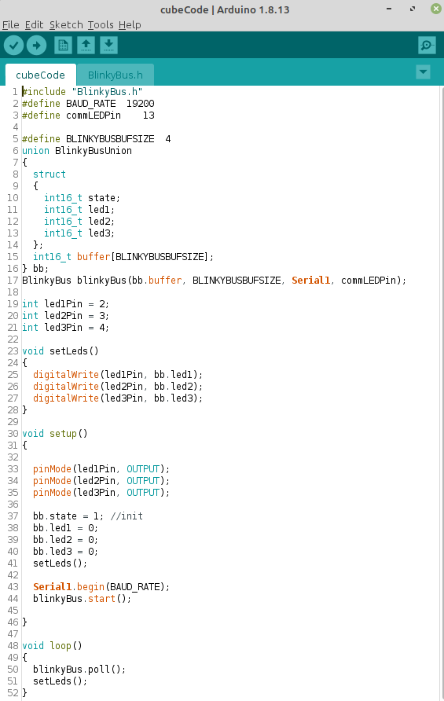

# Blinky Bus Cube
Blinky-Bus is a demonstration project on how to use Blinky-Lite with serial Bluetooth to communicate between the cube and tray. The function of the device is to turn on and off three LEDs.
## Building the circuit
The project can be easily built on a breadboard: 
 

The components required are:
* One [Teensy-LC](https://www.pjrc.com/store/teensylc.html)  micro-controller
* Three LEDs
* Three 220 Ohm resistors
* One [Bluetooth module HC-06](https://www.electrokit.com/en/product/bluetooth-module-hc-06-serial/)
* One [Solderless Breadboard  with 400 tie-points](https://www.electrokit.com/en/product/solderless-breadboard-400-tie-points/)

Wire the circuit up as shown: 
 

## Setting up the Bluetooth
We will use the [Arduino Programming environment](https://www.arduino.cc/en/software) to program the Teensy-LC. In addition to the Arduino programming environment, you will need to install [Teensyduino](https://www.pjrc.com/teensy/teensyduino.html).

You can obtain the source code for the cube by either cloning the repository or downloading a zip file from the green Code button on the [Github page](https://github.com/Blinky-Lite-Exchange/blinky-bus-cube).

The next step is to set the baud rate, pin code, and name of the HC06 Bluetooth module.

This step can be skipped if you are going to use 9600 baud without a pin code. However, <ins>if you do not name the device it will be difficult to find  the device during the pairing process</ins>.

The baud rate, pin code, and name of the HC06 are setup in the sketch contained in the folder HC06-Setup.The HC06 Bluetooth module is connected to the Serial1 port. The default baud rate of the HC06 is 9600. The baud rate on line 24 of the sketch must match this baud rate. For most Blinky-Lite applications, a baud rate of 19200 is sufficient and this is set on line 5 of the sketch. The user can choose any pin or name as long it is only 4 characters long.

Open the Arduino programming environment serial monitor before loading the sketch. Choose the correct board and port under the Tools menu and load the HC06-Setup sketch. If successful, the output of the serial monitor will look like: 
 

Once the HC06-Setup sketch is loaded onto the Teensy-LC, the HC06 Bluetooth module will only communicate at the baud rate defined on line 5 of the HC06-Setup sketch. Any further communication using the HC06-Setup sketch will require to set the baud rate appropriately on line 24.

## Loading the Code
The operating code is contained in the cubeCode.ino sketch 

 

The baud rate is set on line 2 and must match the baud rate set in the HC06-Setup sketch. The commLEDPin sets the LED that will blink during communication exchanges between the cube and the tray.

Next in lines 5-16 is a definition of shared memory between a int16_t buffer and the LED states. The first variable must be ***state***.
* A value of state=1 will signal the tray that the cube has just been initialized.
* A value of state=0 means that the tray has been communicating with the cube.
* The following variables are defined by the user to describe the behavior of the cube.

The cube communicates with the tray during the blinkyBus.poll() routine. During the blinkyBus.poll() routine, the cube checks if the tray has sent any data.
* If the tray has not sent any data, the blinkyBus.poll() routine exits with a return value of zero.
* If the tray sends data, it must send 4 bytes of data.
  - The first byte is the write command.
  - If the write command is 0,
    * then the tray has no data to give the cube
    * and the cube sends the entire buffer to the tray
    * and returns a value of 1
  - If the write command is 1,
    * Then the next byte is the index of the buffer array to be written
    * and the remaining two bytes are the value to be written.
    * The buffer is written with these two bytes at the buffer index specified.
    * The cube sends the entire buffer to the tray
    * and returns a value of 2

After the blinkyBus.poll(), it is possible to determine the last address and value written with the public routines:
* BlinkyBus::getLastWriteAddress()
* BlinkyBus::getLastWriteValue()

Once blinkyBus.poll() routine has been completed, the LEDs are set by current state of the buffer.
