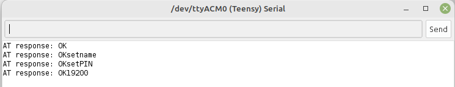

# Blinky Bus Cube
The blinky-bus cube is a demonstration project on how to use Blinky-Lite with serial Bluetooth communications. The goal of the device is to turn on and off three LEDs.
## Building the circuit
The project can be easily built on a breadboard: 
 

The components required are:
* One [Teensy-LC](https://www.pjrc.com/store/teensylc.html)  micro-controller
* Three LEDs
* Three 220 Ohm resistors
* One [Bluetooth module HC-06](https://www.electrokit.com/en/product/bluetooth-module-hc-06-serial/)
* One [Solderless Breadboard  with 400 tie-points](https://www.electrokit.com/en/product/solderless-breadboard-400-tie-points/)

Wire the circuit up as shown: 
 

## Setting up the Bluetooth
We will use the [Arduino Programming environment](https://www.arduino.cc/en/software) to program the Teensy-LC. In addition to the Arduino programming environment, you will need to install [Teensyduino](https://www.pjrc.com/teensy/teensyduino.html).

The next step is to set the baud rate, pin code, and name of the HC06 Bluetooth module. This step can be skipped if you are going to use 9600 baud without a pin code. The baud rate, pin code, and name of the HC06 are setup in the sketch contained in the folder HC06-Setup.The HC06 Bluetooth module is connected to the Serial1 port. The default baud rate of the HC06 is 9600. The baud rate on line 24 of the sketch must match this baud rate. For most Blinky-Lite applications, a baud rate of 19200 is sufficient and this is set on line 5 of the sketch. The user can choose any pin or name as long it is only 4 characters long.

Open the Arduino programming environment serial monitor before loading the sketch. Choose the correct board and port under the Tools menu and load the HC06-Setup sketch. If successful, the output of the serial monitor will look like: 
 

Once the HC06-Setup sketch is loaded onto the Teensy-LC, the HC06 Bluetooth module will only communicate at the baud rate defined on line 5 of the HC06-Setup sketch. Any further communication using the HC06-Setup sketch will require to set the baud rate appropriately on line 24.

## Loading the Code
