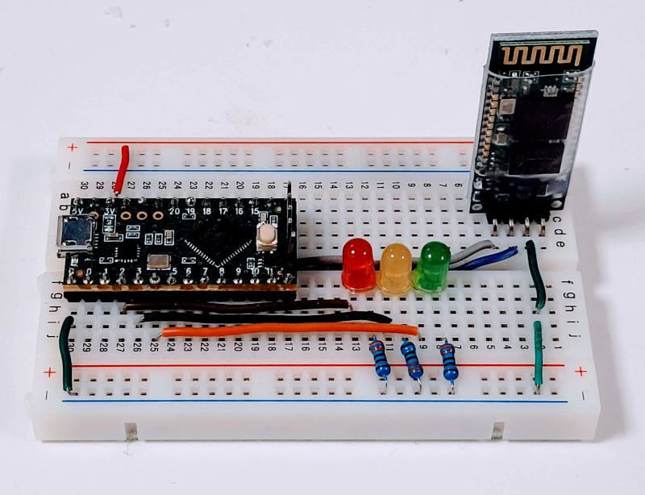
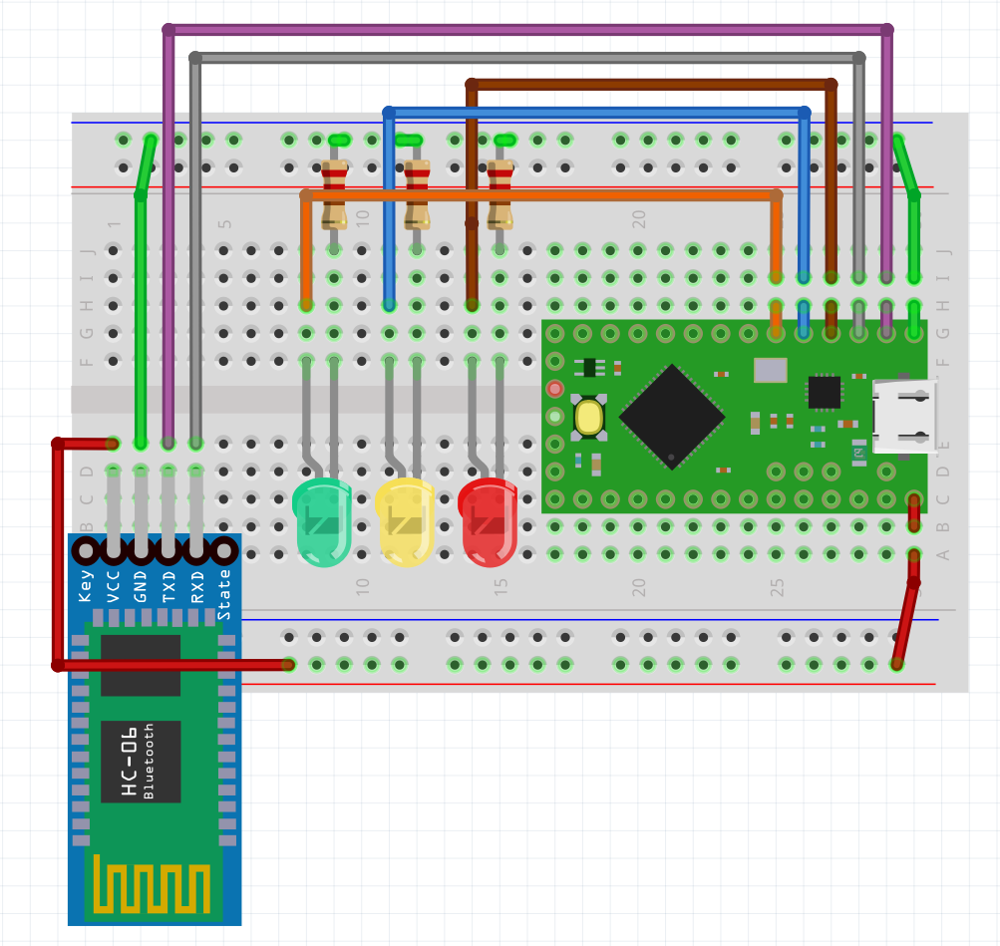

# blinky-bus-cube
The blinky-bus cube is a demonstration project on how to use Blinky-Lite. The goal of the device is to turn on and off three LEDs. The project can be easily built on a breadboard as shown below.
 

The components required are:
* One [Teensy-LC](https://www.pjrc.com/store/teensylc.html)  micro-controller
* Three LEDs
* Three 220 Ohm resistors
* One [Bluetooth module HC-06](https://www.electrokit.com/en/product/bluetooth-module-hc-06-serial/)
* One [Solderless Breadboard  with 400 tie-points](https://www.electrokit.com/en/product/solderless-breadboard-400-tie-points/)

Wire the circuit up as shown below.
 

We will use the [Arduino Programming environment](https://www.arduino.cc/en/software) to program the Teensy-LC. In addition to the Arduino programming environment, you will need to install [Teensyduino](https://www.pjrc.com/teensy/teensyduino.html).

The next step is to set the baud rate, pin code, and name of the HC06 Bluetooth module. This step can be skipped if you are going to use 9600 baud without a pin code. The baud rate, pin code, and name of the HC06 are setup in the sketch contained in the folder HC06-Setup.
